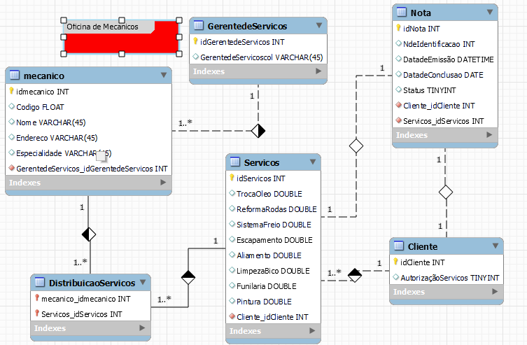

# Mecanico
&#x2022; Sistema de controle e gerenciamento de execução de ordens de serviço em uma oficina mecânica

&#x2022;
Clientes levam veículos à oficina mecânica para serem consertados ou para passarem por revisões  periódicas

&#x2022;
Cada veículo é designado a uma equipe de mecânicos que identifica os serviços a serem executados e preenche uma OS com data de entrega.

&#x2022;
A partir da OS, calcula-se o valor de cada serviço, consultando-se uma tabela de referência de mão-de-obra

&#x2022;
O valor de cada peça também irá compor a OSO cliente autoriza a execução dos serviços

&#x2022;
A mesma equipe avalia e executa os serviços

&#x2022;
Os mecânicos possuem código, nome, endereço e especialidade

&#x2022;
Cada OS possui: n°, data de emissão, um valor, status e uma data para conclusão dos trabalhos.

## Entidades:

### Mecanico

Código 
Nome 
Endereço 
Especialidade 

### Gerenciamento de Serviços

id gerente 
id mecanico

### Nota

n°  
data de emissão 
um valor 
status  
uma data para conclusão dos trabalhos. 

### Serviços

Troca de óleo de câmbio automático. 
Reforma de rodas.  
Troca de fluido do sistema de freios. 
Escapamento.  
Alinhamento 3D e balanceamento. 
Limpeza de bico. 
funilaria e pintura 

### cliente
Orcamento 
Autorizacao do Servico 

